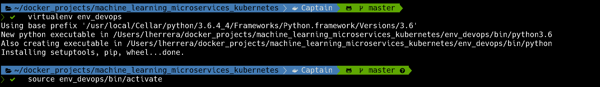
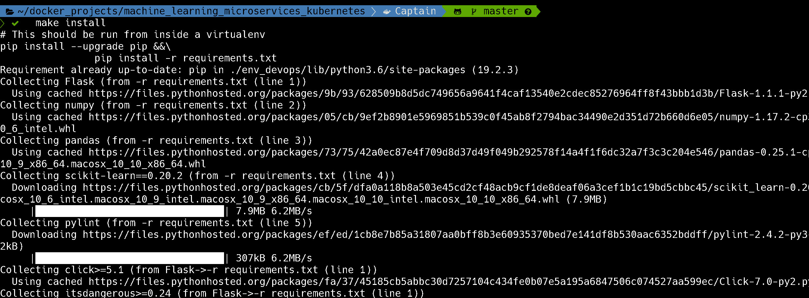
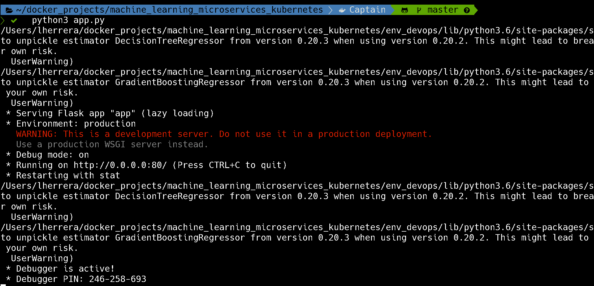
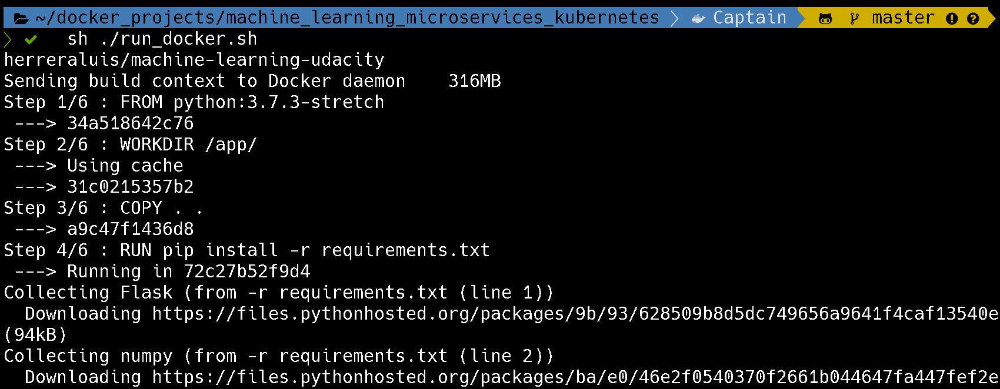
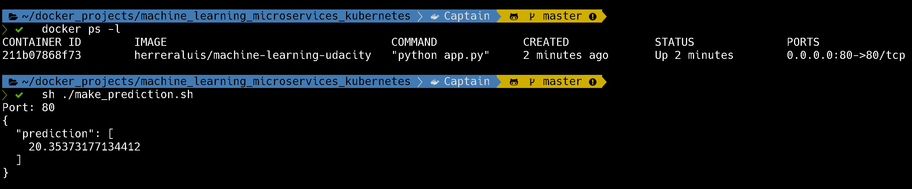
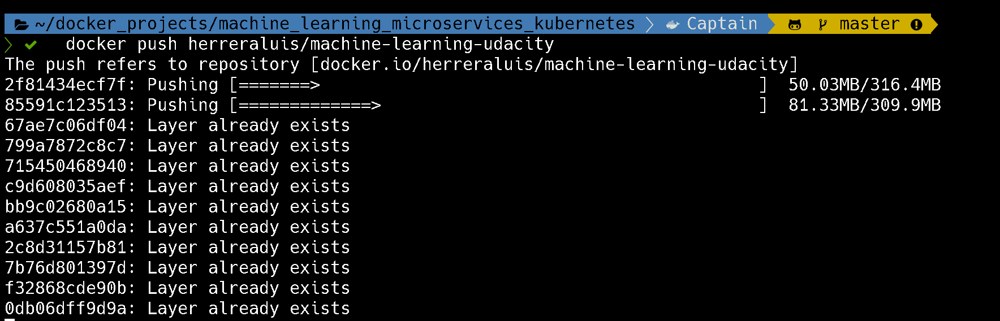
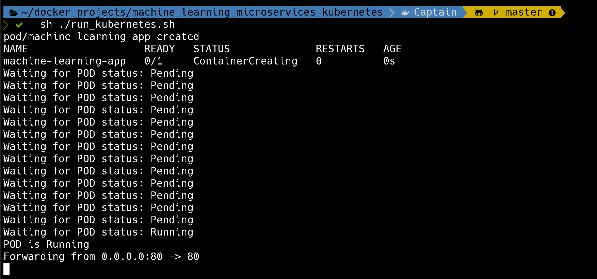
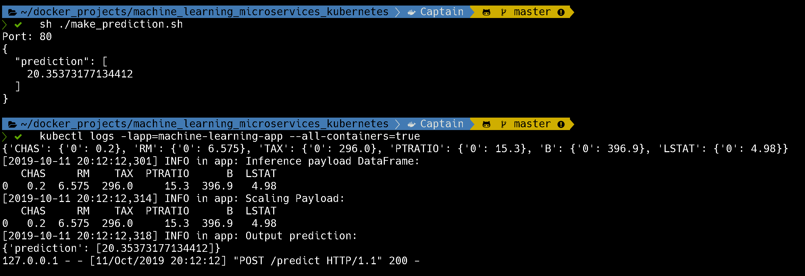
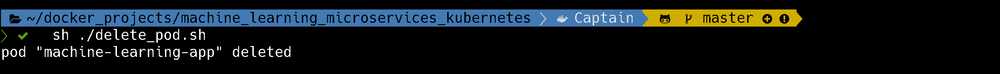
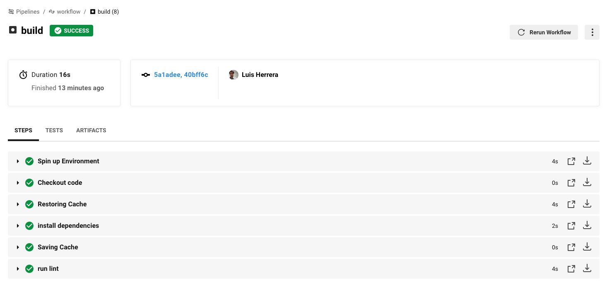

## Execution results

### Running locally
#### Installing and setting virtualenv
 

#### Installing python dependencies
 

#### Running app 
 

---
### Running with Docker
#### Executing run_docker.sh script
 

#### Testing model
 

---
### Running with Kubernetes
#### Before all you need to push your Docker image to the DockerHub
 

#### Executing run_kubernetes.sh script
 

#### Testing model and getting PODs logs
 

#### Removing POD
 

---
### CircleCI Public Status

